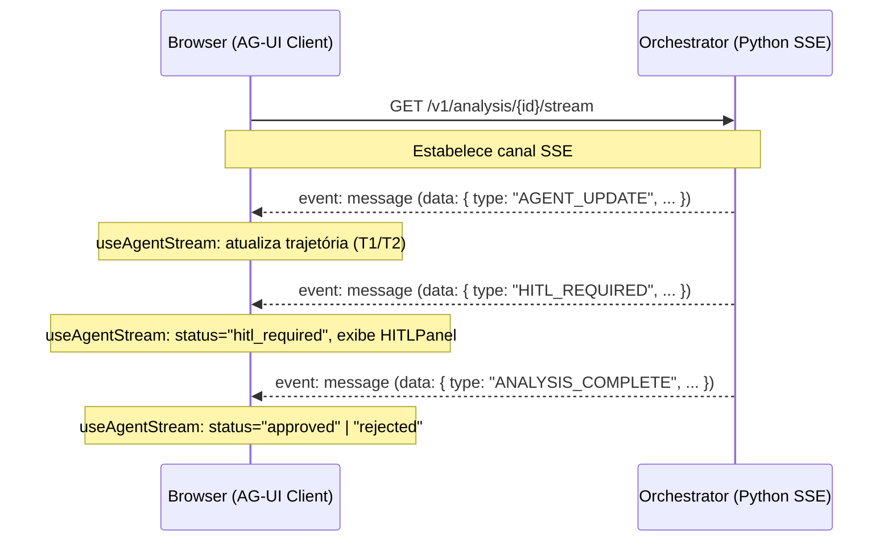

# AGENTS.md — credit-analysis-frontend

Este repositório contém a interface de usuário do sistema de análise de crédito multiagente, estruturada como um monorepo gerenciado via **Turborepo** e construído com a stack moderna **React, TypeScript, Next.js (App Router) e AG-UI Protocol**.

---

## 1. Visão Geral da Estrutura (Monorepo)

O monorepo está dividido em duas aplicações principais (`apps/`) e quatro pacotes internos compartilhados (`packages/`):

### 🏢 Aplicações (`apps/`)

*   **`apps/customer/`**: Portal voltado ao cliente final (solicitante do crédito). Possui a tela de solicitação de crédito (onde se fornece o CPF e valor solicitado) e a tela de acompanhamento em tempo real (`/status/[request_id]`) acoplada ao hook do protocolo AG-UI SSE.
*   **`apps/operator/`**: Portal voltado ao operador humano (mesa de crédito). Contém a fila de propostas pendentes de revisão (`/queue`), a visualização de telemetria e o painel de decisão de intervenção (`/queue/[request_id]`) com botões para aprovar, recusar ou escalar a proposta, além do dashboard de métricas e FinOps (`/dashboard`).

### 📦 Pacotes (`packages/`)

*   **`packages/types/`**: Definições de tipos comuns e interfaces contratuais estritas (`CreditAnalysisStatus`, `HITLRequest`, `OperatorDecision`, `AgentCall`, `AgentTrajectory`).
*   **`packages/ag-ui-client/`**: Cliente oficial de integração com o protocolo AG-UI SSE, implementando o hook `useAgentStream` com suporte nativo a reconexão automática e backoff exponencial.
*   **`packages/ui/`**: Design system compartilhado, fornecendo componentes com tipagem estrita e visual premium (`StatusBadge`, `AgentCard`, `TraceTimeline`, `CostDisplay`, `HITLPanel`).
*   **`packages/auth/`**: Scaffolding e contratos de autenticação baseados em JWT, expondo o hook de contexto `useAuth`.

---

## 2. Protocolo de Integração AG-UI

O loop agêntico do orchestrator expõe os eventos em tempo real em formato de Server-Sent Events (SSE). A conexão é estabelecida de forma unidirecional e em tempo real pelo hook `useAgentStream(endpoint)`.

### Mapeamento de Eventos (EventSource)



Os eventos contêm um campo `type` indicando a ação do orquestrador e um campo `data` (ou propriedades achatadas) que atualiza o estado da interface:
*   **`AGENT_UPDATE`**: Atualiza a trajetória (`AgentTrajectory`) exibindo quais agentes foram acionados, sua latência e ID do Span do OpenTelemetry.
*   **`HITL_REQUIRED`**: Atualiza o status para `hitl_required` e popula a estrutura do painel do operador (`HITLRequest`), exibindo os dados de T1 e T2 consolidados para revisão humana.
*   **`ANALYSIS_COMPLETE`**: Atualiza o status final da proposta (`approved` ou `rejected`).
*   **`ERROR`**: Exibe o log e status de erro técnico no rastreamento.

---

## 3. Variáveis de Ambiente Obrigatórias

Configure as variáveis abaixo em arquivos `.env` específicos de cada aplicação ou nas variáveis globais do shell:

```bash
# URL de endpoint base do Orchestrator Python que expõe o SSE e o /resume
NEXT_PUBLIC_ORCHESTRATOR_URL="http://localhost:8000"

# Tipo de aplicação ativa no ambiente (usado pelo contexto mock de autenticação)
# apps/customer: 'customer' | apps/operator: 'operator'
NEXT_PUBLIC_APP_TYPE="customer"

# Segredo de codificação JWT para validações de sessão
AUTH_SECRET="secret-jwt-token-gateway-validation-key"
```

---

## 4. Guia de Inicialização e Desenvolvimento (Turbo)

Para iniciar o monorepo localmente, certifique-se de ter as dependências instaladas na raiz do projeto e use o motor do **Turborepo** para orquestrar todas as compilações e servidores concorrentemente:

### Executando em Desenvolvimento

Roda o portal do cliente (`apps/customer` na porta `3000`) e o painel do operador (`apps/operator` na porta `3001`):

```bash
npm run dev
```

### Compilando para Produção

Gera os pacotes otimizados e estáticos de distribuição:

```bash
npm run build
```

### Análise Estática & Linting

Verifica conformidade estática de estilo em todas as aplicações e dependências:

```bash
npm run lint
```

### Checagem de Tipos TypeScript

Valida a integridade estrita das assinaturas e contratos de código:

```bash
# Executa tsc --noEmit em todas as pastas gerenciadas pelo Turbo
npm run check-types
```
