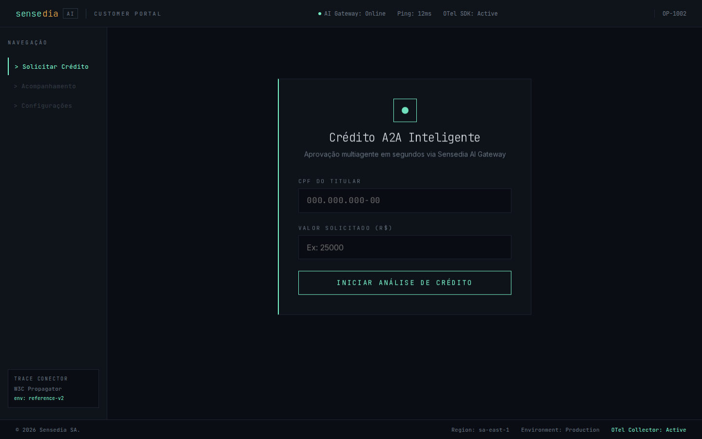

# credit-analysis-frontend

Monorepo para o sistema de análise de crédito multiagente com identidade visual **terminal-brutalism**.

## Design Tokens (paleta canônica)

Definidos em `packages/ui/tokens/tokens.css`. **Não alterar sem ADR.**

| Token     | Valor      | Uso                        |
|-----------|------------|----------------------------|
| `--bg`    | `#0A0E14`  | Fundo global               |
| `--surf`  | `#0F141B`  | Superfície de card/painel  |
| `--acc`   | `#7FFFD4`  | Acento principal (aquamarine) |
| `--alert` | `#FF4655`  | Erro / rejeição            |
| `--warn`  | `#FFB84D`  | Alerta / pendência         |
| `--blue`  | `#7EB8F7`  | Info / análise             |
| `--purple`| `#C9A8F5`  | Uso secundário             |
| `--text`  | `#E6EDF3`  | Texto principal            |
| `--muted` | `#6B7785`  | Texto secundário           |
| `--line`  | `#1E2530`  | Borda sutil                |
| `--line2` | `#2A3340`  | Borda de destaque          |

Proibidos sem ADR: `border-radius > 2px`, `box-shadow` com blur, halos glow, gradientes, `[data-theme="light"]`.

## Screenshot



## Apps

- `apps/customer` — portal do cliente humanizado (porta 3000)
- `apps/operator` — cockpit técnico do operador (porta 3001)

## Desenvolvimento

```sh
npm run dev
```

## OpenSpec

Mudanças de design documentadas em `openspec/changes/`.
